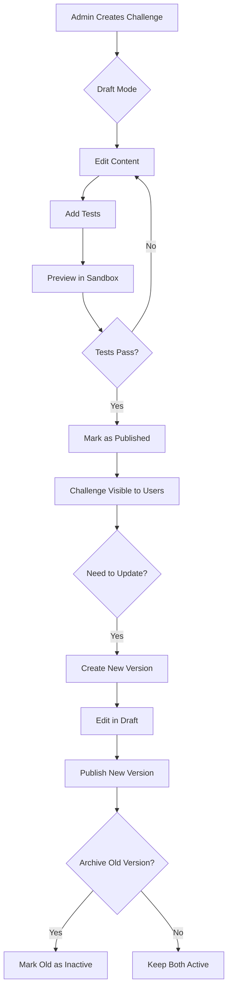

# Database Design Documentation
## Coding Practice Platform

---

## Table of Contents
1. [Versioning Strategy](#versioning-strategy)
2. [Content Publishing Workflow](#content-publishing-workflow)
3. [Performance Optimization](#performance-optimization)
4. [Data Integrity & Constraints](#data-integrity--constraints)
5. [Scalability Considerations](#scalability-considerations)
6. [Security Notes](#security-notes)
7. [Common Use Cases](#common-use-cases)

---

## Versioning Strategy

### Overview
The platform implements a **dual-versioning system** to support content iteration without disrupting active users:

1. **Draft/Published Model** (`is_published` flag)
2. **Version History** (`challenge_versions` table)

### How It Works

#### Option 1: Simple Draft/Published (Recommended for MVP)
```
1. Admin creates/edits a challenge (is_published = false)
2. Admin can preview and test the draft
3. When ready, admin sets is_published = true
4. Users only see published challenges
```

**Pros:**
- Simple to implement
- Minimal storage overhead
- Easy to understand

**Cons:**
- No version history
- Can't revert to previous versions
- No A/B testing capability

#### Option 2: Full Version Control (Production-Grade)
```
1. Admin creates challenge v1 in challenges table (version = 1)
2. When published, copy to challenge_versions (version = 1, is_active = true)
3. Admin edits to create v2 (version = 2 in challenges table)
4. Publishing v2:
   - Mark v1 as is_active = false in challenge_versions
   - Copy v2 to challenge_versions with is_active = true
5. Users always see latest active version from challenge_versions
```

**Pros:**
- Complete version history
- Can rollback to any previous version
- Audit trail for compliance
- A/B testing capability

**Cons:**
- More complex queries
- Higher storage costs
- Requires migration strategy for user progress

### Implementation Recommendation

**Phase 1 (MVP):** Use simple `is_published` flag only
- Faster development
- Meets core requirements
- Easier testing

**Phase 2 (Scale):** Add `challenge_versions` table
- Migrate historical data
- Implement version control UI
- Add rollback functionality

---

## Content Publishing Workflow

### Admin Content Creation Flow



### Publishing States

| State | `is_published` | Visible To | Editable By |
|-------|----------------|------------|-------------|
| **Draft** | `false` | Admins only | Admin who created |
| **Published** | `true` | All users | Admin (creates new version) |
| **Archived** | `false` + `deleted_at` | Admins (read-only) | Cannot edit |

### Best Practices

1. **Always Test Before Publishing**
   - Run all tests in sandbox environment
   - Verify HTML/CSS/JS starter code loads correctly
   - Ensure solution passes all tests

2. **Version Naming Convention**
   - Use semantic versioning: v1.0, v1.1, v2.0
   - Document changes in `updated_at` trigger
   - Add changelog in challenge description

3. **Backward Compatibility**
   - When updating tests, ensure existing user solutions still work
   - If breaking changes, create new challenge instead

4. **Content Approval**
   - Require peer review (add `reviewed_by` field if needed)
   - Check for plagiarism in solutions
   - Verify instructions are clear

---

## Performance Optimization

### Index Strategy

#### Critical Indexes (Already Included)
These support the most common queries:

```sql
-- User lookup (login, profile)
idx_users_email

-- Content hierarchy navigation
idx_modules_track_id
idx_lessons_module_id
idx_challenges_lesson_id

-- User dashboard (progress overview)
idx_progress_user_id
idx_enrollments_user_id

-- Challenge page (attempts history)
idx_attempts_user_challenge (composite: user_id, challenge_id, created_at DESC)

-- Leaderboard queries
idx_progress_challenge_id
idx_progress_status

-- JSONB searches
idx_challenges_tests (GIN index)
idx_attempts_test_results (GIN index)
```

#### Optional Indexes for Analytics
Add these if you need advanced reporting:

```sql
-- Admin dashboard: track completion rates
CREATE INDEX idx_progress_completed_at 
ON user_progress(completed_at) 
WHERE status = 'completed';

-- Track difficulty distribution
CREATE INDEX idx_challenges_difficulty_published 
ON challenges(difficulty) 
WHERE is_published = true;

-- User activity heatmap
CREATE INDEX idx_attempts_created_date 
ON challenge_attempts(DATE(created_at), user_id);
```

### Query Optimization Tips

#### 1. Pagination
Always use `LIMIT` and `OFFSET` for large result sets:

```sql
-- Good: Paginated attempts
SELECT * FROM challenge_attempts
WHERE user_id = 'uuid'
ORDER BY created_at DESC
LIMIT 20 OFFSET 0;

-- Bad: Loading all attempts at once
SELECT * FROM challenge_attempts WHERE user_id = 'uuid';
```

#### 2. Avoid N+1 Queries
Use JOINs instead of multiple queries:

```sql
-- Good: Single query with JOINs
SELECT 
    t.title,
    m.title as module,
    l.title as lesson,
    c.title as challenge
FROM challenges c
JOIN lessons l ON c.lesson_id = l.id
JOIN modules m ON l.module_id = m.id
JOIN tracks t ON m.track_id = t.id;

-- Bad: Fetching each relationship separately
-- (causes N+1 problem in most ORMs)
```

#### 3. Denormalized Counters
The schema includes denormalized fields for performance:

```sql
-- These avoid expensive COUNT(*) queries:
user_progress.total_attempts
user_progress.best_score
user_enrollments.progress_percentage
```

**Update these via triggers or application logic:**

```sql
-- Example trigger to update total_attempts
CREATE OR REPLACE FUNCTION increment_attempt_counter()
RETURNS TRIGGER AS $$
BEGIN
    UPDATE user_progress
    SET total_attempts = total_attempts + 1,
        last_attempt_at = NEW.created_at
    WHERE user_id = NEW.user_id 
      AND challenge_id = NEW.challenge_id;
    RETURN NEW;
END;
$$ LANGUAGE plpgsql;

CREATE TRIGGER increment_attempts
AFTER INSERT ON challenge_attempts
FOR EACH ROW EXECUTE FUNCTION increment_attempt_counter();
```

#### 4. Materialized Views for Dashboards
For complex analytics, use materialized views:

```sql
CREATE MATERIALIZED VIEW mv_track_statistics AS
SELECT 
    t.id as track_id,
    t.title,
    COUNT(DISTINCT c.id) as total_challenges,
    AVG(c.estimated_time_minutes) as avg_time,
    COUNT(DISTINCT ue.user_id) as enrolled_users
FROM tracks t
JOIN modules m ON m.track_id = t.id
JOIN lessons l ON l.module_id = m.id
JOIN challenges c ON c.lesson_id = l.id
LEFT JOIN user_enrollments ue ON ue.track_id = t.id
WHERE t.is_published = true
GROUP BY t.id, t.title;

-- Refresh periodically (e.g., every hour)
CREATE UNIQUE INDEX ON mv_track_statistics (track_id);
REFRESH MATERIALIZED VIEW CONCURRENTLY mv_track_statistics;
```

---

## Data Integrity & Constraints

### Foreign Key Cascades

The schema uses `ON DELETE CASCADE` strategically:

```sql
-- Content hierarchy: deleting a track removes all children
modules.track_id REFERENCES tracks(id) ON DELETE CASCADE

-- User data: deleting a user removes their progress
user_progress.user_id REFERENCES users(id) ON DELETE CASCADE
```

### Check Constraints

Ensure data validity at the database level:

```sql
-- Percentages must be 0-100
CHECK (progress_percentage >= 0 AND progress_percentage <= 100)

-- Positive values only
CHECK (estimated_time_minutes > 0)
CHECK (points >= 0)
```

### Unique Constraints

Prevent duplicate enrollment and duplicate progress records:

```sql
UNIQUE(user_id, challenge_id)  -- One progress record per user per challenge
UNIQUE(user_id, track_id)      -- One enrollment per user per track
UNIQUE(slug)                   -- Unique URLs for tracks
```

---

## Scalability Considerations

### Partitioning Strategy

For platforms with millions of attempts, partition `challenge_attempts`:

```sql
-- Partition by creation month
CREATE TABLE challenge_attempts (
    -- ... columns ...
) PARTITION BY RANGE (created_at);

CREATE TABLE attempts_2026_01 PARTITION OF challenge_attempts
    FOR VALUES FROM ('2026-01-01') TO ('2026-02-01');

CREATE TABLE attempts_2026_02 PARTITION OF challenge_attempts
    FOR VALUES FROM ('2026-02-01') TO ('2026-03-01');

-- Auto-create new partitions with pg_partman extension
```

**Benefits:**
- Faster queries (smaller table scans)
- Easier archival (drop old partitions)
- Better vacuum performance

### Archival Strategy

Archive old attempts after 1 year:

```sql
-- Move to cold storage
CREATE TABLE challenge_attempts_archive (LIKE challenge_attempts);

INSERT INTO challenge_attempts_archive
SELECT * FROM challenge_attempts
WHERE created_at < NOW() - INTERVAL '1 year';

DELETE FROM challenge_attempts
WHERE created_at < NOW() - INTERVAL '1 year';
```

### Read Replicas

For read-heavy workloads:
- **Primary DB:** Writes (attempts, progress updates)
- **Replica 1:** User dashboards, leaderboards
- **Replica 2:** Admin analytics, reporting

### Caching Strategy

Cache frequently accessed data:

```json
{
  "cache_key": "track:{track_id}:challenges",
  "ttl": 3600,
  "invalidate_on": ["challenge_published", "challenge_updated"]
}
```

**What to cache:**
- Published tracks/modules/lessons (rarely change)
- Challenge content (invalidate on publish)
- User progress summaries (invalidate on attempt)

**What NOT to cache:**
- User attempts (too granular)
- Real-time leaderboards (stale data)
- Admin draft content (changes frequently)

---

## Security Notes

### 1. Password Security
Never store plain passwords:

```sql
-- Store bcrypt/argon2 hashed passwords
password_hash VARCHAR(255)

-- Example (in application code):
-- const hash = await bcrypt.hash(password, 12);
```

### 2. SQL Injection Prevention
Always use parameterized queries:

```javascript
// Good (parameterized)
db.query('SELECT * FROM users WHERE email = $1', [userEmail]);

// Bad (vulnerable to SQL injection)
db.query(`SELECT * FROM users WHERE email = '${userEmail}'`);
```

### 3. Row-Level Security (RLS)
Enable RLS for multi-tenant isolation:

```sql
ALTER TABLE user_progress ENABLE ROW LEVEL SECURITY;

CREATE POLICY user_progress_isolation ON user_progress
    USING (user_id = current_setting('app.current_user_id')::uuid);
```

### 4. Sensitive Data
Consider encryption for:
- Email addresses (GDPR compliance)
- User code (intellectual property)
- Test solutions (prevent cheating)

```sql
-- Use pgcrypto extension
CREATE EXTENSION pgcrypto;

-- Encrypt email
UPDATE users SET email = pgp_sym_encrypt(email, 'encryption-key');

-- Decrypt for use
SELECT pgp_sym_decrypt(email::bytea, 'encryption-key') FROM users;
```

---

## Common Use Cases

### 1. Get User's Dashboard Data

```sql
SELECT 
    t.title as track_title,
    t.slug,
    ue.progress_percentage,
    ue.enrolled_at,
    COUNT(DISTINCT c.id) as total_challenges,
    COUNT(DISTINCT CASE WHEN up.status = 'completed' THEN c.id END) as completed,
    SUM(CASE WHEN up.status = 'completed' THEN c.points ELSE 0 END) as total_points
FROM user_enrollments ue
JOIN tracks t ON ue.track_id = t.id
JOIN modules m ON m.track_id = t.id AND m.is_published = true
JOIN lessons l ON l.module_id = m.id AND l.is_published = true
JOIN challenges c ON c.lesson_id = l.id AND c.is_published = true
LEFT JOIN user_progress up ON up.challenge_id = c.id AND up.user_id = ue.user_id
WHERE ue.user_id = $1
GROUP BY t.id, t.title, t.slug, ue.progress_percentage, ue.enrolled_at
ORDER BY ue.enrolled_at DESC;
```

### 2. Load Challenge with User Progress

```sql
SELECT 
    c.*,
    up.status,
    up.best_score,
    up.total_attempts,
    up.last_attempt_at,
    l.title as lesson_title,
    m.title as module_title,
    t.title as track_title
FROM challenges c
JOIN lessons l ON c.lesson_id = l.id
JOIN modules m ON l.module_id = m.id
JOIN tracks t ON m.track_id = t.id
LEFT JOIN user_progress up ON up.challenge_id = c.id AND up.user_id = $1
WHERE c.id = $2 AND c.is_published = true;
```

### 3. Submit Challenge Attempt

```sql
-- Insert attempt
INSERT INTO challenge_attempts (
    user_id, challenge_id, user_code_html, user_code_css, user_code_js,
    status, test_results, score
) VALUES (
    $1, $2, $3, $4, $5, $6, $7, $8
) RETURNING id, created_at;

-- Update user progress
INSERT INTO user_progress (user_id, challenge_id, status, best_score, total_attempts, last_attempt_at)
VALUES ($1, $2, 'in_progress', $3, 1, NOW())
ON CONFLICT (user_id, challenge_id) DO UPDATE SET
    status = CASE WHEN EXCLUDED.status = 'completed' THEN 'completed' ELSE user_progress.status END,
    best_score = GREATEST(user_progress.best_score, EXCLUDED.best_score),
    total_attempts = user_progress.total_attempts + 1,
    last_attempt_at = NOW(),
    completed_at = CASE WHEN EXCLUDED.best_score = 100 AND user_progress.completed_at IS NULL 
                        THEN NOW() ELSE user_progress.completed_at END;
```

### 4. Get Leaderboard

```sql
SELECT 
    u.display_name,
    u.avatar_url,
    up.best_score,
    up.total_attempts,
    up.completed_at,
    RANK() OVER (ORDER BY up.best_score DESC, up.completed_at ASC) as rank
FROM user_progress up
JOIN users u ON up.user_id = u.id
WHERE up.challenge_id = $1 
  AND up.status = 'completed'
ORDER BY rank
LIMIT 10;
```

### 5. Track Completion Stats (Admin)

```sql
SELECT 
    c.title,
    c.difficulty,
    COUNT(DISTINCT up.user_id) as total_users,
    COUNT(DISTINCT CASE WHEN up.status = 'completed' THEN up.user_id END) as completed_users,
    ROUND(100.0 * COUNT(DISTINCT CASE WHEN up.status = 'completed' THEN up.user_id END) / 
          NULLIF(COUNT(DISTINCT up.user_id), 0), 2) as completion_rate,
    AVG(up.best_score) as avg_score,
    AVG(up.total_attempts) as avg_attempts
FROM challenges c
LEFT JOIN user_progress up ON up.challenge_id = c.id
WHERE c.is_published = true
GROUP BY c.id, c.title, c.difficulty
ORDER BY completion_rate ASC;
```

---

## Maintenance & Monitoring

### Regular Tasks

1. **Vacuum & Analyze** (weekly)
```sql
VACUUM ANALYZE challenge_attempts;
VACUUM ANALYZE user_progress;
```

2. **Reindex** (monthly)
```sql
REINDEX TABLE challenge_attempts;
```

3. **Check Bloat** (monthly)
```sql
SELECT schemaname, tablename, 
    pg_size_pretty(pg_total_relation_size(schemaname||'.'||tablename)) as size
FROM pg_tables 
WHERE schemaname = 'public'
ORDER BY pg_total_relation_size(schemaname||'.'||tablename) DESC;
```

### Monitoring Queries

```sql
-- Slow queries
SELECT query, calls, total_time, mean_time
FROM pg_stat_statements
ORDER BY mean_time DESC
LIMIT 10;

-- Table sizes
SELECT relname, pg_size_pretty(pg_total_relation_size(relid))
FROM pg_stat_user_tables
ORDER BY pg_total_relation_size(relid) DESC;

-- Index usage
SELECT schemaname, tablename, indexname, idx_scan, idx_tup_read, idx_tup_fetch
FROM pg_stat_user_indexes
WHERE idx_scan = 0
ORDER BY pg_relation_size(indexrelid) DESC;
```

---

## Future Enhancements

### Potential Additions

1. **Discussion Forums**
   - `challenge_discussions` table
   - Threaded comments on challenges

2. **Hints System**
   - `challenge_hints` table with progressive difficulty
   - Track hint usage in attempts

3. **Achievements/Badges**
   - `achievements` table (e.g., "Speed Demon", "Perfectionist")
   - `user_achievements` junction table

4. **Social Features**
   - `user_followers` (many-to-many)
   - `solution_shares` (public solutions)
   - `solution_votes` (upvote/downvote)

5. **Analytics Events**
   - `user_events` table (page views, time spent)
   - Track drop-off points in challenges

6. **Content Recommendations**
   - ML model based on user progress
   - Similar challenges based on difficulty/topic

---

**This database design is production-ready and follows PostgreSQL best practices for normalization, indexing, and scalability.**
