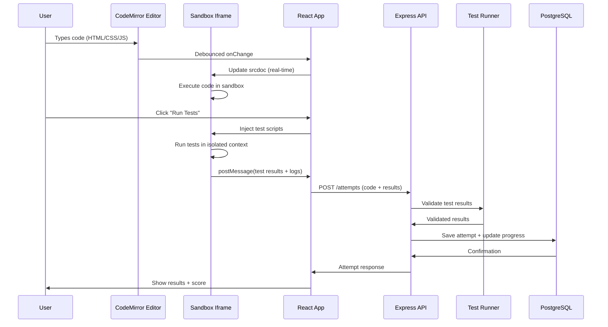

# Implementation Plan - Coding Practice Platform

A full-stack web application for HTML/CSS/JS coding challenges with real-time preview and automated testing.

---

## Tech Stack Summary

**Frontend:**
- React 18 + Vite
- Tailwind CSS
- CodeMirror 6 (code editor)
- Tanstack Query (react-query) for API state
- React Router for navigation
- Zustand for global state

**Backend:**
- Node.js 20+
- Express.js
- PostgreSQL 14+
- Prisma ORM
- JWT (access + refresh tokens)
- bcrypt for password hashing

**DevOps:**
- Docker & Docker Compose
- Nginx (reverse proxy)
- PM2 (process manager)

---

## Project Architecture

### Monorepo Structure

```
coding-practice-platform/
├── frontend/                    # React + Vite app
│   ├── public/
│   ├── src/
│   │   ├── assets/             # Images, fonts, icons
│   │   ├── components/         # Reusable UI components
│   │   │   ├── common/         # Button, Input, Modal, etc.
│   │   │   ├── layout/         # Navbar, Sidebar, Footer
│   │   │   ├── editor/         # CodeMirror wrapper components
│   │   │   └── preview/        # Iframe sandbox preview
│   │   ├── features/           # Feature-based modules
│   │   │   ├── auth/           # Login, Register, Profile
│   │   │   ├── tracks/         # Track list, Track detail
│   │   │   ├── challenges/     # Challenge editor, Leaderboard
│   │   │   ├── progress/       # Dashboard, History
│   │   │   └── admin/          # Content management
│   │   ├── hooks/              # Custom React hooks
│   │   ├── services/           # API client, auth service
│   │   ├── store/              # Zustand stores
│   │   ├── utils/              # Helper functions
│   │   ├── types/              # TypeScript types
│   │   ├── App.tsx
│   │   └── main.tsx
│   ├── package.json
│   ├── tailwind.config.js
│   └── vite.config.ts
│
├── backend/                     # Node.js + Express API
│   ├── src/
│   │   ├── config/             # Environment, database config
│   │   ├── controllers/        # Route handlers
│   │   │   ├── auth.controller.ts
│   │   │   ├── tracks.controller.ts
│   │   │   ├── challenges.controller.ts
│   │   │   ├── attempts.controller.ts
│   │   │   ├── progress.controller.ts
│   │   │   └── admin.controller.ts
│   │   ├── middleware/         # Auth, validation, error handling
│   │   │   ├── auth.middleware.ts
│   │   │   ├── validation.middleware.ts
│   │   │   ├── error.middleware.ts
│   │   │   └── rate-limit.middleware.ts
│   │   ├── routes/             # Express routers
│   │   │   ├── auth.routes.ts
│   │   │   ├── tracks.routes.ts
│   │   │   ├── challenges.routes.ts
│   │   │   └── admin.routes.ts
│   │   ├── services/           # Business logic
│   │   │   ├── auth.service.ts
│   │   │   ├── challenge.service.ts
│   │   │   ├── attempt.service.ts
│   │   │   └── test-runner.service.ts
│   │   ├── validators/         # Zod schemas
│   │   │   └── challenge.validator.ts
│   │   ├── types/              # TypeScript interfaces
│   │   ├── utils/              # Helpers, logger
│   │   ├── prisma/             # Prisma schema & migrations
│   │   │   ├── schema.prisma
│   │   │   └── migrations/
│   │   ├── app.ts              # Express app setup
│   │   └── server.ts           # Server entry point
│   ├── package.json
│   └── tsconfig.json
│
├── docker-compose.yml           # Local development setup
├── .env.example
└── README.md
```

---

## API Endpoints Specification

### Base URL: `/api/v1`

### Authentication Endpoints

#### POST `/auth/register`
Register a new user account.

**Request:**
```json
{
  "email": "user@example.com",
  "password": "SecurePass123!",
  "displayName": "John Doe"
}
```

**Response (201):**
```json
{
  "user": {
    "id": "uuid-here",
    "email": "user@example.com",
    "displayName": "John Doe",
    "role": "user"
  },
  "tokens": {
    "accessToken": "eyJhbGciOiJIUzI1NiIs...",
    "refreshToken": "eyJhbGciOiJIUzI1NiIs..."
  }
}
```

---

#### POST `/auth/login`
User login.

**Request:**
```json
{
  "email": "user@example.com",
  "password": "SecurePass123!"
}
```

**Response (200):**
```json
{
  "user": {
    "id": "uuid-here",
    "email": "user@example.com",
    "displayName": "John Doe",
    "role": "user"
  },
  "tokens": {
    "accessToken": "eyJhbGciOiJIUzI1NiIs...",
    "refreshToken": "eyJhbGciOiJIUzI1NiIs..."
  }
}
```

---

#### POST `/auth/refresh`
Refresh access token using refresh token.

**Request:**
```json
{
  "refreshToken": "eyJhbGciOiJIUzI1NiIs..."
}
```

**Response (200):**
```json
{
  "accessToken": "eyJhbGciOiJIUzI1NiIs...",
  "refreshToken": "eyJhbGciOiJIUzI1NiIs..."
}
```

---

#### POST `/auth/logout`
Invalidate refresh token.

**Headers:** `Authorization: Bearer <access_token>`

**Response (204):** No content

---

### Track Endpoints

#### GET `/tracks`
Get all published tracks.

**Response (200):**
```json
{
  "tracks": [
    {
      "id": "uuid-1",
      "title": "HTML Fundamentals",
      "slug": "html-fundamentals",
      "description": "Learn HTML from scratch",
      "iconUrl": "https://...",
      "displayOrder": 1,
      "totalChallenges": 25,
      "estimatedHours": 8
    }
  ]
}
```

---

#### GET `/tracks/:slug`
Get track details with modules.

**Response (200):**
```json
{
  "track": {
    "id": "uuid-1",
    "title": "HTML Fundamentals",
    "slug": "html-fundamentals",
    "description": "Learn HTML from scratch",
    "modules": [
      {
        "id": "module-uuid",
        "title": "Getting Started with HTML",
        "displayOrder": 1,
        "lessons": [
          {
            "id": "lesson-uuid",
            "title": "Your First HTML Page",
            "displayOrder": 1,
            "challenges": [
              {
                "id": "challenge-uuid",
                "title": "Create a Heading",
                "difficulty": "beginner",
                "estimatedTimeMinutes": 5,
                "points": 10
              }
            ]
          }
        ]
      }
    ]
  },
  "userProgress": {
    "enrolled": true,
    "progressPercentage": 42.5,
    "completedChallenges": 10,
    "totalChallenges": 25
  }
}
```

---

#### POST `/tracks/:trackId/enroll`
Enroll current user in a track.

**Headers:** `Authorization: Bearer <access_token>`

**Response (201):**
```json
{
  "enrollment": {
    "id": "enrollment-uuid",
    "trackId": "track-uuid",
    "userId": "user-uuid",
    "enrolledAt": "2026-02-03T14:30:00Z"
  }
}
```

---

### Challenge Endpoints

#### GET `/challenges/:challengeId`
Get challenge details with user progress.

**Headers:** `Authorization: Bearer <access_token>`

**Response (200):**
```json
{
  "challenge": {
    "id": "challenge-uuid",
    "title": "Create a Heading",
    "instructions": "# Create Your First Heading\n\nCreate an `<h1>` tag...",
    "starterCode": {
      "html": "<!DOCTYPE html>\n<html>\n<body>\n  \n</body>\n</html>",
      "css": "",
      "js": ""
    },
    "tests": [
      {
        "name": "Should have an h1 element",
        "test": "expect(document.querySelector('h1')).toBeTruthy()"
      }
    ],
    "difficulty": "beginner",
    "estimatedTimeMinutes": 5,
    "points": 10
  },
  "userProgress": {
    "status": "in_progress",
    "bestScore": 75.5,
    "totalAttempts": 3,
    "lastAttemptAt": "2026-02-03T12:00:00Z"
  },
  "navigation": {
    "previous": {
      "id": "prev-challenge-uuid",
      "title": "Introduction to HTML"
    },
    "next": {
      "id": "next-challenge-uuid",
      "title": "Adding Paragraphs"
    }
  }
}
```

---

#### POST `/challenges/:challengeId/attempts`
Submit a code attempt for testing.

**Headers:** `Authorization: Bearer <access_token>`

**Request:**
```json
{
  "userCode": {
    "html": "<!DOCTYPE html>\n<html>\n<body>\n  <h1>Hello World</h1>\n</body>\n</html>",
    "css": "h1 { color: blue; }",
    "js": "console.log('Hello');"
  }
}
```

**Response (201):**
```json
{
  "attempt": {
    "id": "attempt-uuid",
    "status": "pass",
    "score": 100,
    "testResults": [
      {
        "name": "Should have an h1 element",
        "passed": true,
        "message": "Found h1 element",
        "actualValue": "<h1>Hello World</h1>"
      }
    ],
    "runtimeLogs": "Hello\n",
    "executionTimeMs": 12,
    "createdAt": "2026-02-03T14:45:00Z"
  },
  "updatedProgress": {
    "status": "completed",
    "bestScore": 100,
    "totalAttempts": 4
  }
}
```

---

#### GET `/challenges/:challengeId/attempts`
Get user's attempt history for a challenge.

**Headers:** `Authorization: Bearer <access_token>`

**Query Params:**
- `limit` (default: 10)
- `offset` (default: 0)

**Response (200):**
```json
{
  "attempts": [
    {
      "id": "attempt-uuid",
      "status": "pass",
      "score": 100,
      "createdAt": "2026-02-03T14:45:00Z"
    }
  ],
  "pagination": {
    "total": 15,
    "limit": 10,
    "offset": 0
  }
}
```

---

#### GET `/challenges/:challengeId/leaderboard`
Get top scores for a challenge.

**Query Params:**
- `limit` (default: 10)

**Response (200):**
```json
{
  "leaderboard": [
    {
      "rank": 1,
      "user": {
        "id": "user-uuid",
        "displayName": "Jane Smith",
        "avatarUrl": "https://..."
      },
      "bestScore": 100,
      "totalAttempts": 2,
      "completedAt": "2026-02-01T10:00:00Z"
    }
  ]
}
```

---

### Progress Endpoints

#### GET `/progress/dashboard`
Get user's learning dashboard.

**Headers:** `Authorization: Bearer <access_token>`

**Response (200):**
```json
{
  "stats": {
    "totalPoints": 1250,
    "challengesCompleted": 42,
    "currentStreak": 7,
    "totalAttempts": 135
  },
  "enrollments": [
    {
      "track": {
        "id": "track-uuid",
        "title": "HTML Fundamentals",
        "slug": "html-fundamentals"
      },
      "progressPercentage": 68.5,
      "completedChallenges": 17,
      "totalChallenges": 25,
      "lastAccessedAt": "2026-02-03T14:00:00Z"
    }
  ],
  "recentAttempts": [
    {
      "challenge": {
        "id": "challenge-uuid",
        "title": "Create a Heading"
      },
      "status": "pass",
      "score": 100,
      "createdAt": "2026-02-03T14:45:00Z"
    }
  ]
}
```

---

### Admin Endpoints

> [!IMPORTANT]
> All admin endpoints require `role: admin` in JWT payload.

#### POST `/admin/challenges`
Create a new challenge (draft).

**Headers:** `Authorization: Bearer <access_token>`

**Request:**
```json
{
  "lessonId": "lesson-uuid",
  "title": "Create a Heading",
  "instructions": "# Create Your First Heading\n\n...",
  "starterCode": {
    "html": "<!DOCTYPE html>\n...",
    "css": "",
    "js": ""
  },
  "solutionCode": {
    "html": "<!DOCTYPE html>\n<html>\n<body>\n  <h1>Hello</h1>\n</body>\n</html>",
    "css": "",
    "js": ""
  },
  "tests": [
    {
      "name": "Should have an h1 element",
      "test": "expect(document.querySelector('h1')).toBeTruthy()"
    }
  ],
  "difficulty": "beginner",
  "estimatedTimeMinutes": 5,
  "points": 10,
  "displayOrder": 1
}
```

**Response (201):**
```json
{
  "challenge": {
    "id": "new-challenge-uuid",
    "title": "Create a Heading",
    "isPublished": false,
    "version": 1,
    "createdAt": "2026-02-03T15:00:00Z"
  }
}
```

---

#### PATCH `/admin/challenges/:challengeId/publish`
Publish a challenge.

**Headers:** `Authorization: Bearer <access_token>`

**Response (200):**
```json
{
  "challenge": {
    "id": "challenge-uuid",
    "isPublished": true,
    "publishedAt": "2026-02-03T15:05:00Z"
  }
}
```

---

#### GET `/admin/challenges/:challengeId/analytics`
Get challenge analytics.

**Headers:** `Authorization: Bearer <access_token>`

**Response (200):**
```json
{
  "analytics": {
    "totalAttempts": 1250,
    "uniqueUsers": 420,
    "completionRate": 78.5,
    "averageScore": 85.2,
    "averageAttempts": 2.8,
    "averageTimeMinutes": 7.5,
    "difficultyDistribution": {
      "tooEasy": 15,
      "justRight": 370,
      "tooHard": 35
    }
  }
}
```

---

## Data Flow: Code Execution Pipeline

### Overview



### Step-by-Step Flow

#### 1. Editor Input (Real-time Preview)

**Frontend (React Component):**
```typescript
const ChallengeEditor = () => {
  const [code, setCode] = useState({
    html: starterCode.html,
    css: starterCode.css,
    js: starterCode.js
  });

  // Debounce preview updates
  const debouncedPreview = useMemo(
    () => debounce((newCode) => {
      updatePreview(newCode);
    }, 300),
    []
  );

  const handleCodeChange = (language: string, value: string) => {
    const newCode = { ...code, [language]: value };
    setCode(newCode);
    debouncedPreview(newCode);
  };

  return (
    <div>
      <CodeMirrorEditor 
        value={code.html} 
        onChange={(val) => handleCodeChange('html', val)}
      />
      <SandboxPreview code={code} />
    </div>
  );
};
```

---

#### 2. Sandbox Preview (Iframe)

**Frontend (Sandbox Component):**
```typescript
const SandboxPreview = ({ code }: { code: CodeState }) => {
  const [logs, setLogs] = useState<string[]>([]);

  const srcdoc = useMemo(() => `
    <!DOCTYPE html>
    <html>
      <head>
        <style>${code.css}</style>
        <script>
          // Capture console logs
          const consoleLog = console.log;
          const consoleError = console.error;
          const logs = [];
          
          console.log = (...args) => {
            logs.push({ type: 'log', message: args.join(' ') });
            window.parent.postMessage({ type: 'console', logs }, '*');
            consoleLog.apply(console, args);
          };
          
          console.error = (...args) => {
            logs.push({ type: 'error', message: args.join(' ') });
            window.parent.postMessage({ type: 'console', logs }, '*');
            consoleError.apply(console, args);
          };
          
          // Capture runtime errors
          window.onerror = (msg, url, line, col, error) => {
            const errorMsg = \`Error: \${msg} at line \${line}\`;
            logs.push({ type: 'error', message: errorMsg });
            window.parent.postMessage({ type: 'console', logs }, '*');
          };
        </script>
      </head>
      <body>
        ${code.html}
        <script>${code.js}</script>
      </body>
    </html>
  `, [code]);

  useEffect(() => {
    const handleMessage = (event: MessageEvent) => {
      if (event.data.type === 'console') {
        setLogs(event.data.logs);
      }
    };

    window.addEventListener('message', handleMessage);
    return () => window.removeEventListener('message', handleMessage);
  }, []);

  return (
    <div>
      <iframe
        srcDoc={srcdoc}
        sandbox="allow-scripts"
        title="Preview"
        className="w-full h-full border-0"
      />
      <ConsolePanel logs={logs} />
    </div>
  );
};
```

---

#### 3. Test Execution (Client-Side)

**Frontend (Test Runner):**
```typescript
const runTests = async (code: CodeState, tests: Test[]) => {
  const iframeRef = useRef<HTMLIFrameElement>(null);

  const executeTests = () => {
    return new Promise((resolve) => {
      const testScript = `
        <script>
          ${tests.map((test, idx) => `
            (function() {
              const result = { name: "${test.name}", passed: false, message: "" };
              try {
                ${test.test}
                result.passed = true;
                result.message = "Test passed";
              } catch (error) {
                result.passed = false;
                result.message = error.message;
              }
              window.parent.postMessage({ 
                type: 'test-result', 
                index: ${idx}, 
                result 
              }, '*');
            })();
          `).join('\n')}
        </script>
      `;

      const fullDoc = srcdoc.replace('</body>', `${testScript}</body>`);
      iframeRef.current!.srcdoc = fullDoc;

      const results: TestResult[] = [];
      const handleMessage = (event: MessageEvent) => {
        if (event.data.type === 'test-result') {
          results[event.data.index] = event.data.result;
          
          if (results.filter(Boolean).length === tests.length) {
            window.removeEventListener('message', handleMessage);
            resolve(results);
          }
        }
      };

      window.addEventListener('message', handleMessage);
    });
  };

  const results = await executeTests();
  return results;
};
```

---

#### 4. Submit Attempt (Backend Validation)

**Frontend (Submit Handler):**
```typescript
const handleSubmit = async () => {
  const startTime = Date.now();
  
  // Run tests client-side
  const testResults = await runTests(code, challenge.tests);
  const executionTime = Date.now() - startTime;
  
  // Calculate score
  const passedTests = testResults.filter(r => r.passed).length;
  const score = (passedTests / testResults.length) * 100;
  const status = score === 100 ? 'pass' : 'fail';

  // Submit to backend
  const response = await api.post(`/challenges/${challengeId}/attempts`, {
    userCode: code,
    testResults,
    status,
    score,
    runtimeLogs: logs.join('\n'),
    executionTimeMs: executionTime
  });

  // Update UI
  setAttemptResult(response.data.attempt);
  setUserProgress(response.data.updatedProgress);
};
```

---

#### 5. Backend Processing

**Backend (Attempt Controller):**
```typescript
export const submitAttempt = async (req: Request, res: Response) => {
  const { challengeId } = req.params;
  const { userCode, testResults, status, score, runtimeLogs, executionTimeMs } = req.body;
  const userId = req.user.id;

  // Validate request
  const validation = attemptSchema.safeParse(req.body);
  if (!validation.success) {
    return res.status(400).json({ error: validation.error });
  }

  // Security: Re-validate test results server-side (optional but recommended)
  const challenge = await prisma.challenge.findUnique({
    where: { id: challengeId },
    include: { tests: true }
  });

  // Server-side test validation (prevent cheating)
  const serverValidation = await testRunnerService.validate(
    userCode,
    challenge.tests,
    testResults
  );

  if (!serverValidation.isValid) {
    return res.status(400).json({ 
      error: 'Test results validation failed',
      details: serverValidation.errors 
    });
  }

  // Save attempt
  const attempt = await prisma.challengeAttempt.create({
    data: {
      userId,
      challengeId,
      userCodeHtml: userCode.html,
      userCodeCss: userCode.css,
      userCodeJs: userCode.js,
      status,
      testResults: JSON.stringify(testResults),
      runtimeLogs,
      executionTimeMs,
      score
    }
  });

  // Update user progress (upsert)
  const progress = await prisma.userProgress.upsert({
    where: {
      userId_challengeId: { userId, challengeId }
    },
    create: {
      userId,
      challengeId,
      status: score === 100 ? 'completed' : 'in_progress',
      bestScore: score,
      totalAttempts: 1,
      lastAttemptAt: new Date(),
      completedAt: score === 100 ? new Date() : null
    },
    update: {
      status: score === 100 ? 'completed' : undefined,
      bestScore: { set: Math.max(score, existing.bestScore) },
      totalAttempts: { increment: 1 },
      lastAttemptAt: new Date(),
      completedAt: score === 100 && !existing.completedAt ? new Date() : undefined
    }
  });

  res.status(201).json({
    attempt,
    updatedProgress: progress
  });
};
```

---

## Security Considerations

### 1. Sandbox Iframe Security

> [!CAUTION]
> **Critical:** Always use `sandbox` attribute to isolate untrusted code.

**Sandbox Configuration:**
```html
<iframe 
  sandbox="allow-scripts"
  srcDoc={userGeneratedHTML}
  title="Code Preview"
/>
```

**Allowed Permissions:**
- `allow-scripts` - Required for JS execution
- ❌ `allow-same-origin` - **NEVER enable** (prevents DOM access to parent)
- ❌ `allow-forms` - Not needed for challenges
- ❌ `allow-popups` - Prevents popup spam

---

### 2. XSS Prevention

**Server-Side:**
```typescript
import DOMPurify from 'isomorphic-dompurify';

// Sanitize user-submitted code before storing
const sanitizedHtml = DOMPurify.sanitize(userCode.html, {
  ALLOWED_TAGS: ['div', 'span', 'p', 'h1', 'h2', 'h3', 'img', 'a', ...],
  ALLOWED_ATTR: ['class', 'id', 'href', 'src', 'alt', ...]
});
```

**Client-Side:**
- Never use `dangerouslySetInnerHTML` for user code
- Always render code in sandboxed iframe
- Escape code when displaying in UI (syntax highlighting)

---

### 3. Code Storage Security

**Best Practices:**
```typescript
// Hash sensitive test code
const testHash = crypto
  .createHash('sha256')
  .update(JSON.stringify(tests))
  .digest('hex');

// Store hash and validate on retrieval
const isTestTampered = savedHash !== testHash;
```

**Database:**
- Store code as TEXT (escaped automatically by Prisma)
- Add `CHECK` constraint on code length (prevent DoS)
- Index frequently queried fields only

```sql
-- Limit code size
ALTER TABLE challenge_attempts 
ADD CONSTRAINT max_code_length 
CHECK (
  LENGTH(user_code_html) < 50000 AND
  LENGTH(user_code_css) < 50000 AND
  LENGTH(user_code_js) < 50000
);
```

---

### 4. JWT Security

**Access Token:**
- Expiry: 15 minutes
- Payload: `{ userId, email, role }`
- Storage: Memory (React state)

**Refresh Token:**
- Expiry: 7 days
- Storage: HttpOnly cookie
- Rotation: Issue new refresh token on each refresh

**Implementation:**
```typescript
// Backend
const accessToken = jwt.sign(
  { userId: user.id, email: user.email, role: user.role },
  process.env.JWT_ACCESS_SECRET,
  { expiresIn: '15m' }
);

const refreshToken = jwt.sign(
  { userId: user.id },
  process.env.JWT_REFRESH_SECRET,
  { expiresIn: '7d' }
);

res.cookie('refreshToken', refreshToken, {
  httpOnly: true,
  secure: process.env.NODE_ENV === 'production',
  sameSite: 'strict',
  maxAge: 7 * 24 * 60 * 60 * 1000 // 7 days
});
```

---

### 5. Rate Limiting

**Prevent Abuse:**
```typescript
import rateLimit from 'express-rate-limit';

// Attempt submission: 10 per minute
const attemptLimiter = rateLimit({
  windowMs: 60 * 1000,
  max: 10,
  message: 'Too many attempts, please try again later'
});

router.post('/challenges/:id/attempts', attemptLimiter, submitAttempt);

// Auth: 5 login attempts per 15 minutes
const authLimiter = rateLimit({
  windowMs: 15 * 60 * 1000,
  max: 5,
  message: 'Too many login attempts'
});

router.post('/auth/login', authLimiter, login);
```

---

### 6. Input Validation

**Use Zod for type-safe validation:**
```typescript
import { z } from 'zod';

const attemptSchema = z.object({
  userCode: z.object({
    html: z.string().max(50000),
    css: z.string().max(50000),
    js: z.string().max(50000)
  }),
  testResults: z.array(z.object({
    name: z.string(),
    passed: z.boolean(),
    message: z.string()
  })),
  status: z.enum(['pass', 'fail', 'error']),
  score: z.number().min(0).max(100),
  runtimeLogs: z.string().optional(),
  executionTimeMs: z.number().int().positive()
});
```

---

### 7. CORS Configuration

```typescript
import cors from 'cors';

app.use(cors({
  origin: process.env.FRONTEND_URL || 'http://localhost:5173',
  credentials: true, // Allow cookies
  methods: ['GET', 'POST', 'PUT', 'PATCH', 'DELETE'],
  allowedHeaders: ['Content-Type', 'Authorization']
}));
```

---

## Development Milestones

### Phase 1: MVP (4-6 weeks)

#### Week 1-2: Foundation
- [x] **Setup Projects**
  - Initialize frontend (Vite + React + Tailwind)
  - Initialize backend (Express + Prisma)
  - Setup PostgreSQL with Docker
  - Run schema migrations
  
- [x] **Authentication**
  - Register/Login API endpoints
  - JWT generation and validation
  - Password hashing with bcrypt
  - Protected route middleware
  - Frontend auth context and login UI

- [x] **Basic UI Components**
  - Design system with Tailwind
  - Navbar, Footer, Layout
  - Button, Input, Modal components
  - Responsive design

---

#### Week 3-4: Core Features
- [ ] **Content Hierarchy**
  - Tracks list page (GET /tracks)
  - Track detail with modules/lessons (GET /tracks/:slug)
  - Challenge page skeleton
  - Track enrollment API

- [ ] **Code Editor Integration**
  - CodeMirror 6 setup with HTML/CSS/JS modes
  - Split pane layout (editor + preview)
  - Tab switching (HTML/CSS/JS)
  - Syntax highlighting and autocomplete

- [ ] **Live Preview**
  - Sandboxed iframe component
  - Real-time code execution
  - Console log capture
  - Error handling and display

---

#### Week 5-6: Testing & Progress
- [ ] **Test Runner**
  - Client-side test execution
  - Test result UI (pass/fail badges)
  - Score calculation
  - Submit attempt API (POST /attempts)

- [ ] **Progress Tracking**
  - User dashboard (GET /progress/dashboard)
  - Challenge completion status
  - Progress indicators on track pages
  - Attempt history UI

- [ ] **Polish & Deploy**
  - Error handling and loading states
  - Toast notifications
  - Mobile responsive fixes
  - Docker deployment setup

---

### Phase 2: Enhanced Features (4-6 weeks)

#### Week 7-8: Admin Panel
- [ ] **Content Management**
  - Admin dashboard layout
  - Create/Edit challenge forms
  - Markdown editor for instructions
  - Test case builder UI
  - Draft/Publish workflow

- [ ] **Analytics**
  - Challenge analytics dashboard
  - Completion rate charts
  - Average score metrics
  - User engagement metrics

---

#### Week 9-10: Social Features
- [ ] **Leaderboards**
  - Global leaderboard (GET /leaderboard)
  - Per-challenge leaderboard
  - Rank calculation
  - Leaderboard UI with animations

- [ ] **User Profiles**
  - Public profile pages
  - Achievement badges
  - Activity timeline
  - Edit profile settings

---

#### Week 11-12: Advanced Features
- [ ] **Code Solutions**
  - View solution after completion
  - Side-by-side comparison (user vs solution)
  - Solution explanations (video/text)

- [ ] **Hints System**
  - Progressive hints (3 levels)
  - Hint penalty on score
  - Hint unlock UI

- [ ] **Saved Progress**
  - Auto-save code to local storage
  - Resume from last save
  - Version history (last 5 attempts)

---

### Phase 3: Production Polish (2-4 weeks)

#### Week 13-14: Performance
- [ ] **Optimization**
  - Code splitting and lazy loading
  - Image optimization
  - Database query optimization
  - Redis caching for frequent queries
  - CDN for static assets

- [ ] **Testing**
  - Unit tests (Jest + React Testing Library)
  - E2E tests (Playwright)
  - API integration tests
  - Load testing (k6)

---

#### Week 15-16: DevOps
- [ ] **Deployment**
  - CI/CD pipeline (GitHub Actions)
  - Production Docker setup
  - Database migrations automation
  - Environment variable management
  - Monitoring (Sentry for errors)
  - Analytics (Plausible/Google Analytics)

- [ ] **Documentation**
  - API documentation (Swagger)
  - User guides
  - Admin guides
  - Developer setup guide

---

## Quick Start Commands

### Initial Setup

```bash
# Clone repository
git clone <repo-url>
cd coding-practice-platform

# Install dependencies
cd frontend && npm install
cd ../backend && npm install

# Setup environment
cp .env.example .env
# Edit .env with your configurations

# Start PostgreSQL with Docker
docker-compose up -d postgres

# Run migrations
cd backend && npx prisma migrate dev

# Seed database (optional)
npm run seed
```

---

### Development

```bash
# Terminal 1: Start backend
cd backend
npm run dev  # Runs on http://localhost:3000

# Terminal 2: Start frontend
cd frontend
npm run dev  # Runs on http://localhost:5173
```

---

### Production Build

```bash
# Build frontend
cd frontend
npm run build

# Build backend
cd backend
npm run build

# Start with Docker Compose
docker-compose up -d
```

---

## Summary

This implementation plan provides:

✅ **Clear Architecture** - Monorepo with frontend/backend separation  
✅ **Complete API Spec** - 15+ REST endpoints with request/response examples  
✅ **Secure Code Execution** - Sandboxed iframe with console capture  
✅ **JWT Authentication** - Access + refresh token strategy  
✅ **Phased Milestones** - MVP in 6 weeks, full v2 in 12 weeks  
✅ **Security First** - XSS prevention, rate limiting, input validation  
✅ **Production Ready** - Docker, CI/CD, monitoring, testing  

**Next Steps:** Review and approve this plan, then proceed to implementation starting with Phase 1 Week 1-2 foundation tasks.
